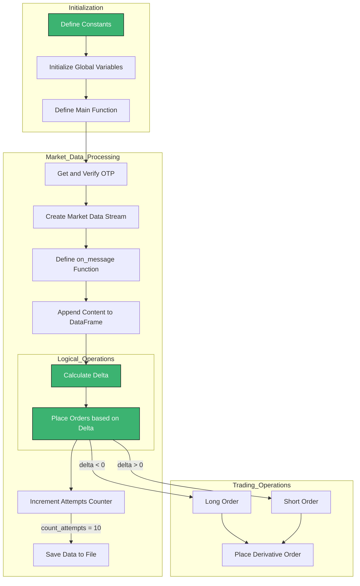

# Workflow

```mermaid
graph TB

subgraph Initialization
    A[Define Constants]
    B[Initialize Global Variables]
    C[Define Main Function]
end

subgraph Market_Data_Processing
    M[Get and Verify OTP]
    D[Create Market Data Stream]
    E[Define on_message Function]
    F[Append Content to DataFrame]
    subgraph Logical_Operations
        G[Calculate Delta]
        H[Place Orders based on Delta]
    end
    I[Increment Attempts Counter]
    J[Save Data to File]
end

subgraph Trading_Operations
    K[Long Order]
    L[Short Order]
    N[Place Derivative Order]
end

A --> B
B --> C
C --> M

M --> D
D --> E
E --> F
F --> G
G --> H
H --> I
I -->|count_attempts = 10| J

H -->|delta < 0| K
H -->|delta > 0| L

K --> N
L --> N

style A fill:#3CB371,stroke:#000000,color:#ffffff;
style G fill:#3CB371,stroke:#000000,color:#ffffff;
style H fill:#3CB371,stroke:#000000,color:#ffffff;
```
