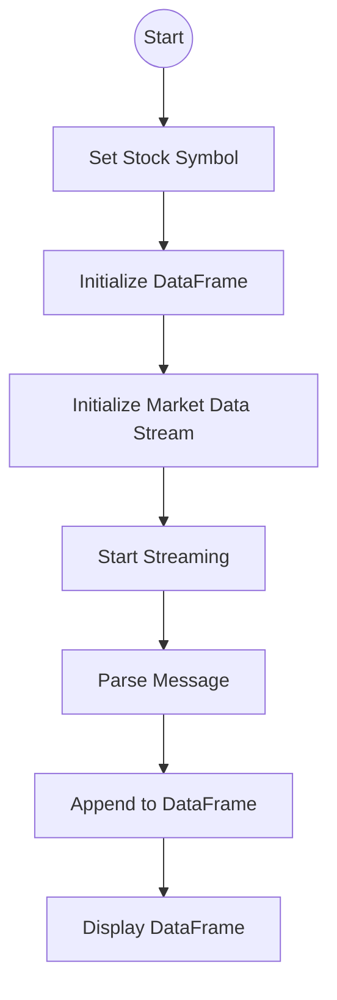

```mermaid
graph TD

Z((Start)) --> A[Set Stock Symbol]
A --> B[Initialize DataFrame]
B --> C[Initialize Market Data Stream]
C --> D[Start Streaming]
D --> E[Parse Message]
E --> F[Append to DataFrame]
F --> G[Display DataFrame]
```