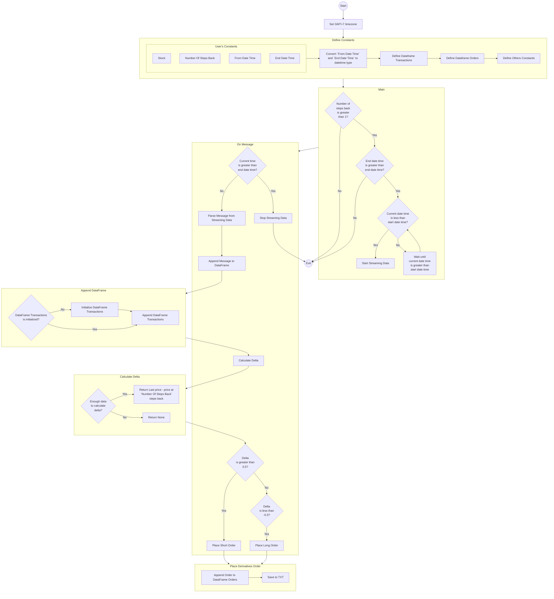

# Workflow

```mermaid
graph TB

A((Start)) --> B[Set GMT+7 timezone]
B --> SC

subgraph SC[Define Constants]
    subgraph SU[User's Constants]
        C[Stock]
        D[Number Of Steps Back]
        E[From Date Time]
        F[End Date Time]
    end
    SU --> G[Convert `From Date Time` and `End Date Time` to datetime type]
    G --> AF[Define Dataframe Transactions]
    AF --> AG[Define Dataframe Orders]
    AG --> H[Define Others Constants]
end

SC --> SM

subgraph SM[Main]
    I{Number of <br> steps back <br> is greater <br> than 1?}
    I --> |Yes| J{End date time <br> is greater than <br> end date time?}
    J --> |Yes| K{Current date time <br> is less than <br> start date time?}
    K --> |Yes| L[Start Streaming Data]
    K --> |No| M[Wait until <br> current date time <br> is greater than <br> start date time]
    M --> K
end

I --> |No| Z((Exit))
J --> |No| Z
SM --> SO

subgraph SO[On Message]
    N{Current time <br> is greater than <br> end date time?}
    N --> |Yes| O[Stop Streaming Data]
    N --> |No| P[Parse Message from Streaming Data]
    P --> Q[Append Message to DataFrame]
    R[Calculate Delta]
    S{Delta <br> is greater than <br> 0.5?}
    S --> |Yes| T[Place Short Order]
    S --> |No| U{Delta <br> is less than <br> -0.3?}
    U --> |Yes| V[Place Long Order]
end

O --> Z
Q --> SA
SA --> R

subgraph SA[Append DataFrame]
    W{DataFrame Transactions <br> is initialized?} --> |No| X[Initialize DataFrame Transactions]
    X --> Y[Append DataFrame Transactions]
    W --> |Yes| Y
end

R --> SD
SD --> S

subgraph SD[Calculate Delta]
    AA{Enough data <br> to calculate <br> delta?} --> |Yes| AB[Return Last price - price at <br> `Number Of Steps Back` <br> steps back]
    AA --> |No| AC[Return None]
end

T --> SP
V --> SP

subgraph SP[Place Derivatives Order]
    AD[Append Order to DataFrame Orders] --> AE[Save to TXT]
end
```
